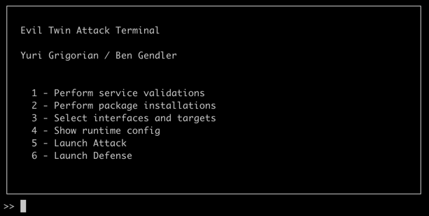
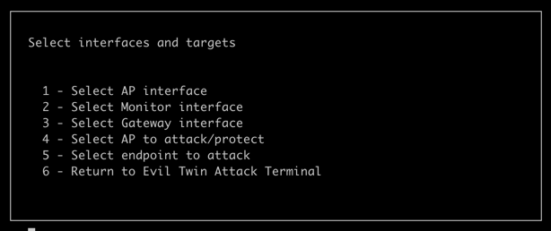
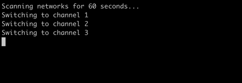
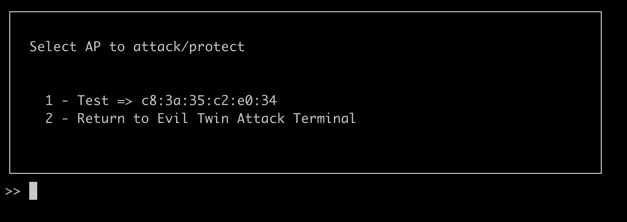
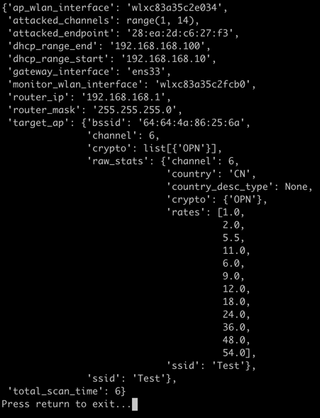
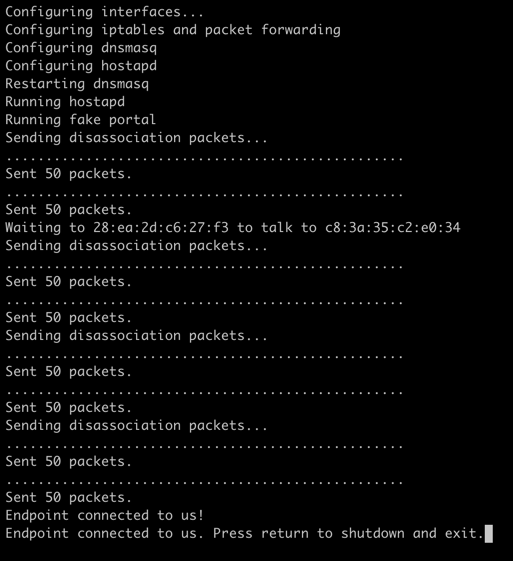
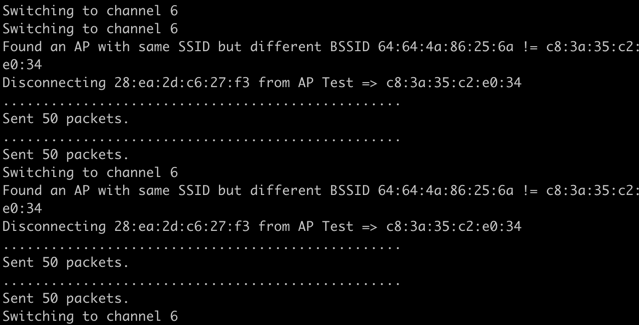

# Evil Twin Attack

#### Yuri Grigorian / Benny Gendler

This repo contains an exercise implementation to perform an evil twin attack on open networks.
It also includes a defence mechanism to mitigate such attacks.

- [Evil Twin Attack](#evil-twin-attack)
    + [Requirements](#requirements)
    + [Installing Apt Dependencies](#installing-apt-dependencies)
    + [Creating The Python Virtualenv And Installing Dependencies](#creating-the-python-virtualenv-and-installing-dependencies)
    + [Caveats due to driver issues](#caveats-due-to-driver-issues)
    + [Attack Mechanism Explanation](#attack-mechanism-explanation)
        - [DNS Hijacking](#dns-hijacking)
    + [Defence Mechanism Explanation](#defence-mechanism-explanation)
    + [Clearing Before Running](#clearing-before-running)
    + [Running Attack](#running-attack)
    + [Running Defence](#running-defence)

<small><i><a href='http://ecotrust-canada.github.io/markdown-toc/'>Table of contents generated with markdown-toc</a></i></small>

### Requirements
1. OS: `Ubuntu 22.04LTS / Kali Linux`
2. Two WLAN network adapters supporting monitor mode.
3. Drivers supporting monitor mode already installed and preconfigured (Ours were builtin for `RT2870/RT3070 Wireless Adapter`)

### Installing Apt Dependencies
1. `apt install -y python3`
2. `apt install iw dnsmasq net-tools vim hostapd wireless-tools bridge-utils`

### Creating The Python Virtualenv And Installing Dependencies
In the repo folder perform:
1. `virtualenv v`
2. `source v/bin/activate`
3. `pip3 install -r requirements.txt`

### Caveats due to driver issues
1. Our wireless network cards could not change to monitor mode if `ifconfig <iwface> up` was performed on them before. 
Solution is to run `sh clear.sh` and reconnect the cards physically.

### Attack Mechanism Explanation
After configuring the interfaces in the software and selecting a target AP and endpoint, 
the attack will start a fake portal, a fake hijacking dns server, a dhcp server and a duplicate AP. 
It will then send disassociation packets between AP<->Endpoint. 
It will continue doing so until the endpoint had connected to us.

#### DNS Hijacking
Our solution opens a fake portal on port 80 and a DNS server that hijacks all records to point to our host.

### Defence Mechanism Explanation
In a loop:  
After selecting an AP to protect the system will start scanning for new APs with the same SSID. 
It will then sniff clients talking to that fake AP and send disassociation packets to them specifically.

***

### Clearing Before Running
1. Please run `sh clear.sh` before starting working.

### Running Attack
1. Run `sh run.sh`
2. Go to 3 and configure all interfaces, target AP and endpoint. Gateway device is the one you use to talk to the internet.  
  
  
  
4. Show config to make sure all is filled and correct:  
  
5. Run 5 from the main menu. An example for proper output:  
   
6. Go to any page in the connected endpoint and find:  
      
7. Entering the credentials will show up in `portal/info/credentials.txt`

### Running Defence
* Note that running Attack + Defence on the same monitor is not recommended as they both change channels and might interfere with each other.
A third card is recommended.
* Note that our solution protects only 1 AP for POC purposes.
That is solved by scanning all BSSIDs with the target SSID and going by them, attacking any new BSSID that tries 
to also the same SSID. 
1. Run `sh run.sh`
2. Go to 3 and configure monitor interface and a target AP.
3. Run 6 from main menu. A proper output:  
